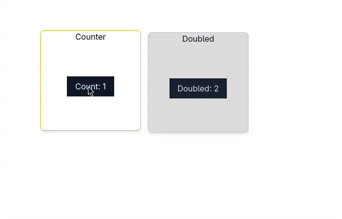

# what is Panekit?

Panekit is a headless window manager toolkit for Svelte 5.

The idea behind Panekit originates from old school MDI style GUI from the era of Java Swing and Visual Fox Pro, with a modern touch in the form of tiling modes (Coming soon!) and a declarative style.



## ⚠️ WARNING ⚠️

If you are planning to use this, beware of the following:

- Early development. Expect many bugs, broken reactivity and wildly changing APIs.
- I put 0 effort in optimizing (yet)
- I put 0 effort in bundle size (yet)
- I don't plan on properly supporting mobile until Neodrag is ripped out for a different solution. This is currently already buggy on mobile, and I haven't figured out how to fix it.
- If a library helps, I will add it, but the objective is to have no (core) depedendencies in v1.
- Breaking changes will happen, in fact maybe even guaranteed to happen every minor version (until V1)
- I have no tests. This is not because I don't want to test, Playwright just doesn't run in Fedora. (I am open to test though! just tell me how)
- I've made this mainly for my personal use, specifically to rewrite the aforementioned MDI style GUIs into more portable web based UI, however I will still accept feature PRs if useful.
- I am a backend dev, that means I am kinda clueless about what good frontend code entails.

## Installation

This library has a peer dependency on svelte 5, **specifically 5.29 or newer**, as it uses attachments to work.

```bash
npm i panekit
```

## Usage

### Basic Setup

First, wrap your application with the `PanekitProvider`. This creates the context needed for window management and sets up a portal target (inside the provider) where panes will be rendered.

```svelte
<script>
  import { PanekitProvider } from 'panekit';
  // CSS is optional, but recommended
  import "panekit/index.css"
</script>

<PanekitProvider>
  <div class="h-dvh w-dvw">
    <!-- Your app content -->
  </div>
</PanekitProvider>
```

### Creating Panes

Panes use a state-driven architecture with `PaneState` instances that manage all pane properties reactively.

```svelte
<script>
  import { Pane, PaneState } from 'panekit';
  
  // Create a PaneState instance with configuration
  const myPane = new PaneState({
    size: { width: 400, height: 300 },
    constrainToPortal: true,
    portalId: 'main-panel'
  });
  
  let count = $state(0);
</script>

<Pane.Root paneState={myPane} class="rounded-md border bg-white shadow-md">
  <Pane.Handle class="flex items-center justify-center">
    Window Title
  </Pane.Handle>
  <Pane.Content class="flex items-center justify-center">
    <button onclick={() => (count += 1)}>
      Count: {count}
    </button>
  </Pane.Content>
</Pane.Root>
```

### PaneState

`PaneState` is a reactive class that manages all pane properties. All properties are reactive using runes and can be read or updated at any time. these properties will also be properly tracked if used inside an `$effect`.

**Constructor Options:**

```typescript
new PaneState({
  // Identity
  id?: string,                    // Custom pane ID (auto-generated UUID if not provided)
  
  // Layout
  size?: { width: number; height: number },  // Initial size (default: 200x200)
  position?: { x: number; y: number },       // Initial position (default: centered)
  maximised?: boolean,                       // Start maximized (default: false)
  
  // Portal configuration
  portalId?: string,              // Target portal ID
  constrainToPortal?: boolean,    // Keep pane within portal bounds (default: false)
  constrainTo?: HTMLElement | string,  // Constrain to specific element/selector
  
  // Interaction
  canDrag?: boolean,              // Enable dragging (default: true)
  canResize?: boolean,            // Enable resizing (default: true)
  dragModifier?: DragModifier,    // Modifier key for full-pane drag (default: 'altKey')
  
  // Resize configuration
  resizeHandles?: ResizeHandle[], // Which handles to show (default: all 8)
  resizeHandleSize?: number,      // Handle size in pixels (default: 8)
  resizeHandleOffset?: number,    // Handle offset from edge (default: 8)
  invisibleResizeHandles?: boolean,  // Hide handles visually (default: true)
  minWidth?: number,              // Minimum width constraint
  minHeight?: number,             // Minimum height constraint
  maxWidth?: number,              // Maximum width constraint
  maxHeight?: number              // Maximum height constraint
})
```

**Reactive Properties:**

```typescript
// All properties are reactive and can be read/written
pane.size          // { width: number, height: number }
pane.position      // { x: number, y: number } | undefined
pane.maximised     // boolean
pane.focused       // boolean (read-only, managed by manager)
pane.isDragging    // boolean (read-only)
pane.isResizing    // boolean (read-only)
```

**Methods:**

```typescript
pane.maximize()    // Maximize the pane to fill its portal
pane.restore()     // Restore to pre-maximized size and position
pane.focus()       // Bring pane to front
pane.blur()        // Remove focus
```

**Example - Dynamic Configuration:**

```svelte
<script>
  const pane = new PaneState({ 
    constrainToPortal: true,
    minWidth: 200,
    minHeight: 150
  });
  
  // Reactively update properties
  function toggleMaximize() {
    if (pane.maximised) {
      pane.restore();
    } else {
      pane.maximize();
    }
  }
  
  function makeSmaller() {
    pane.size = { 
      width: pane.size.width - 50, 
      height: pane.size.height - 50 
    };
  }
</script>

<Pane.Root paneState={pane}>
  <Pane.Handle>
    Size: {pane.size.width}x{pane.size.height}
  </Pane.Handle>
  <Pane.Content>
    <button onclick={toggleMaximize}>
      {pane.maximised ? 'Restore' : 'Maximize'}
    </button>
    <button onclick={makeSmaller}>Make Smaller</button>
    <p>Dragging: {pane.isDragging ? 'Yes' : 'No'}</p>
  </Pane.Content>
</Pane.Root>
```

### Components

#### `PanekitProvider`

The root provider component that must wrap your application.

**Props:**

- `dragModifier?: DragModifier` - Global modifier key for full-pane dragging (`'altKey' | 'ctrlKey' | 'shiftKey' | 'metaKey'`). Default: `'altKey'`

#### `Pane.Root`

The main pane container. **Requires a `paneState` prop.**

**Props:**

- `paneState: PaneState` - **(Required)** The PaneState instance managing this pane
- Standard HTML div attributes

**Behavior:**

- Panes can be dragged by their handle
- Hold the drag modifier key (Alt by default) to drag from anywhere on the pane
- Panes are resizable from all edges and corners by default
- Clicking a pane brings it to focus (higher z-index)
- Panes automatically stay within portal bounds when `constrainToPortal` is enabled
- Panes automatically adjust position/size when portal resizes (e.g., browser window resize)

#### `Pane.Handle`

The draggable header/title bar of the pane.

**Props:**

- Standard HTML div attributes

#### `Pane.Content`

The main content area of the pane.

**Props:**

- Standard HTML div attributes  

#### `Pane.PortalTarget`

Portal target component for rendering panes. The provider includes one by default, but you can create additional targets.

**Props:**

- `portalId?: string` - Unique identifier for this portal target

### Advanced Usage

#### Custom Portal Targets

You can create multiple portal targets to render panes in different areas:

```svelte
<script>
  import { Pane, PaneState } from 'panekit';
  
  const leftPane = new PaneState({
    portalId: 'left-panel',
    constrainToPortal: true
  });
  
  const rightPane = new PaneState({
    portalId: 'right-panel',
    constrainToPortal: true,
    size: { width: 300, height: 250 }
  });
</script>

<PanekitProvider>
  <div class="flex h-screen">
    <div class="flex-1">
      <Pane.PortalTarget portalId="left-panel" />
    </div>
    <div class="flex-1">  
      <Pane.PortalTarget portalId="right-panel" />
    </div>
  </div>
  
  <!-- Panes render in their respective portals -->
  <Pane.Root paneState={leftPane}>
    <Pane.Handle>Left Side Window</Pane.Handle>
    <Pane.Content>Content here</Pane.Content>
  </Pane.Root>
  
  <Pane.Root paneState={rightPane}>
    <Pane.Handle>Right Side Window</Pane.Handle>
    <Pane.Content>Content here</Pane.Content>
  </Pane.Root>
</PanekitProvider>
```

#### Pane Management

The library provides a pane manager for programmatic control:

```svelte
<script>
  import { usePM, PaneState } from 'panekit';
  
  const paneManager = usePM();
  const myPane = new PaneState({ id: 'my-pane' });
  
  function focusPane() {
    paneManager.focusPane('my-pane');
  }
  
  function blurAllPanes() {
    paneManager.blurAll();
  }
  
  function maximizePane() {
    paneManager.maximizePane('my-pane');
  }
  
  // Query panes
  const allPanes = paneManager.panes;              // Get all panes
  const pane = paneManager.getPaneById('my-pane'); // Get specific pane
  const portalPanes = paneManager.getPanesByPortal('left-panel'); // Get panes in portal
</script>
```

### Styling

Panekit is headless and provides minimal default styling. It's designed with utility classes in mind, classes are deduplicated and merged via the `cn` helper internally, so svelte 5 cslx classes should still work just fine.

You can style based on data attributes if needed. each component has data attributes you can hook into for styling:

- `[data-pane]` - Applied to pane root elements
- `[data-pane-handle]` - Applied to handle elements  
- `[data-pane-content]` - Applied to content elements
- `[data-pane-portal-target]` - Applied to portal target elements

More data attributes will be added so that you can style based on drag state, resize state, focus state and so on. I am just hammered with work so I didn't do it yet.

NOTE: The way we currently generate CSS for the library is a bit wonky and may create conflicts, if anyone has a better idea on how to do this better (maybe I should have just used plain CSS...) I am all ears.

### Browser Support

I honestly have no idea.
